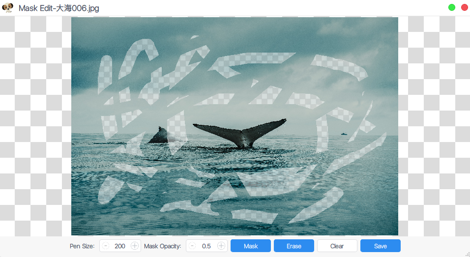
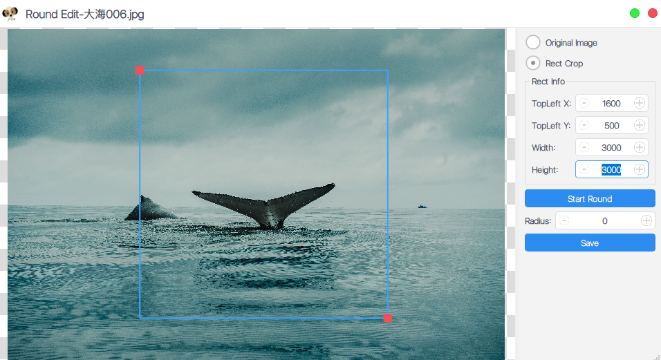
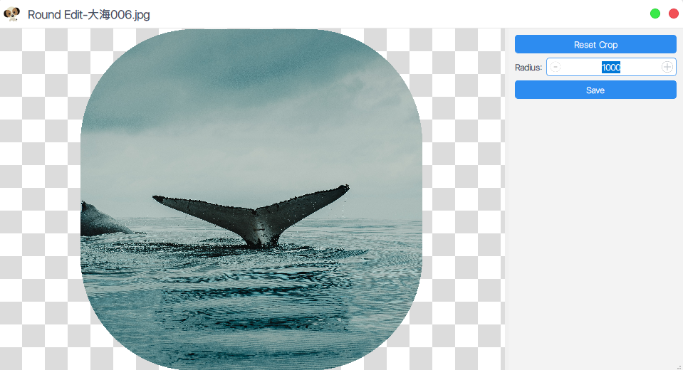
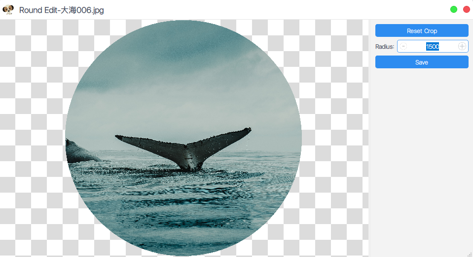
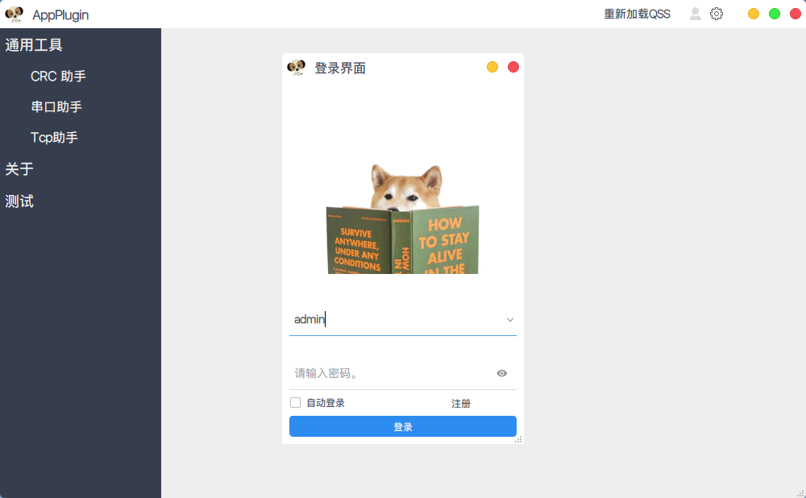
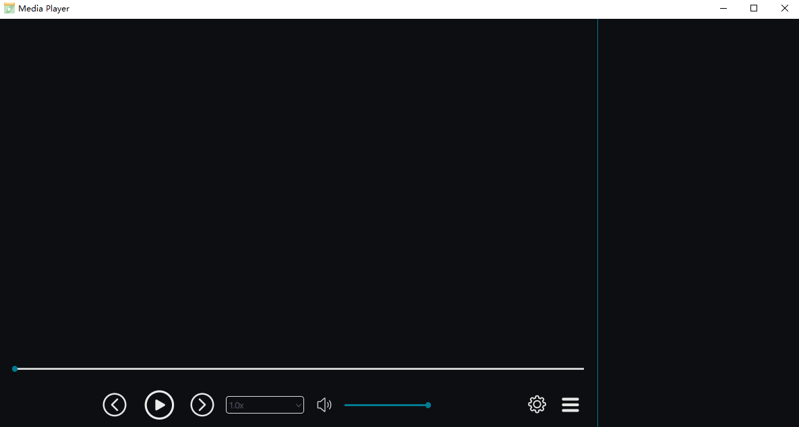

# AppTools  

## [English Description](README_en.md)  

图片资源等来自于互联网。  
本代码仓库，仅供学习，若被他人用于商业用途 与本人无关！ 请遵守许可证！  

## 公用的库最新的在app-subdir文件夹中

环境：Qt 6.2.2	Visual Studio 2019  

UI参考：[ 应用模版 ](https://github.com/xtuer/template-app/tree/master/template-qt "xtuer/template-app")  

1. PictureTool：基于Qt  Graphics View Framework框架写的看图和绘制简单图形的简易框架；  

2. Plugin-Template：基于QtCreator的插件系统写的模板工程，有几个小功能 ；  

4. MediaPlayer ：超级简约十分简单的多媒体播放器（需要安装LAVFilters以便可以解码更多格式的音视频）；

   1. 另[Qt+Ffmpeg音视频播放器](https://github.com/RealChuan/FfmpegPlayer)，界面很粗糙（UI可参考本程序）；   
   
   

### 使用方法：  

1. 先编译构建；  

2. 把源码`resource`文件夹复制到编译出来的可执行文件所在目录（源码`bin-32(64)/debug(release)/`）；  

4. 在可执行程序路径下（`bin-32(64)/debug(release)/`）新建`translations`文件夹，用QtCreator工具-外部-Qt语言家发布翻译到`translations`文件夹；  

5. 启动程序。  

   

### 界面展示：  

1. #### Picture-Tool：  

   1. ##### 看图界面：  
   	

  
   	
   2. ##### 马赛克绘制界面（橡皮擦效果）：  
   

  
   
   3. ##### 圆角编辑窗口（也可编辑成圆形图标）：  

      

  
   
      

  
   
      

  
   
   4. ##### 简单图形绘制界面：  
   
   

  
   
2. #### Plugin-Template
   
   

  
   
   

  
   
3. #### MediaPlayer  

   

  
   
   

  