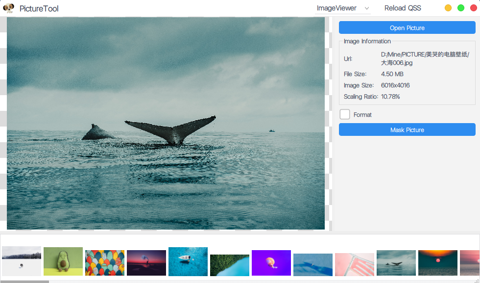
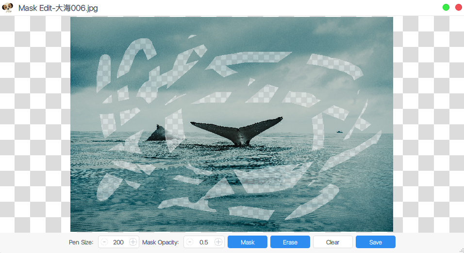
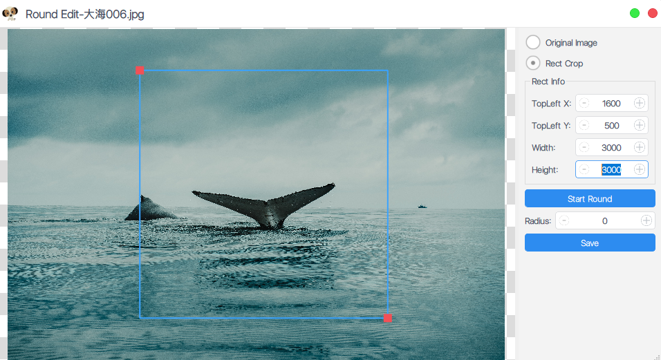
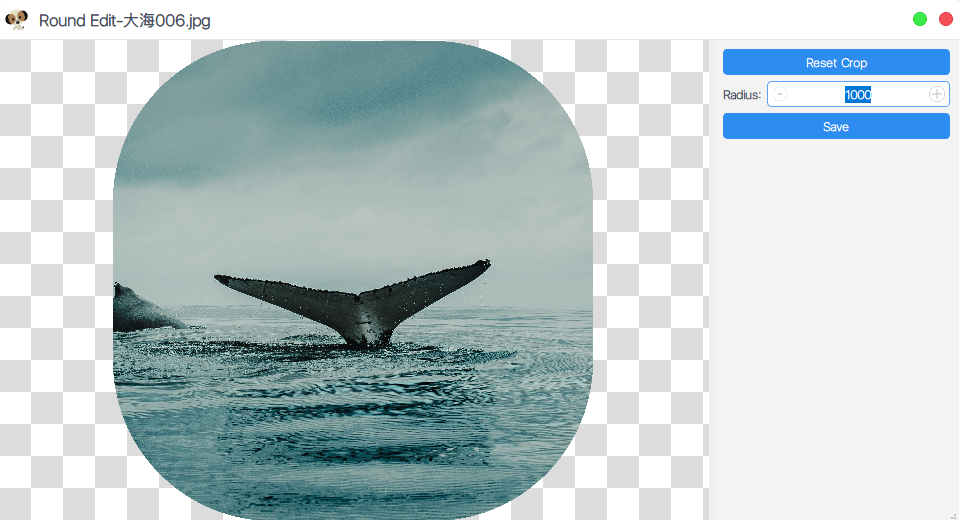
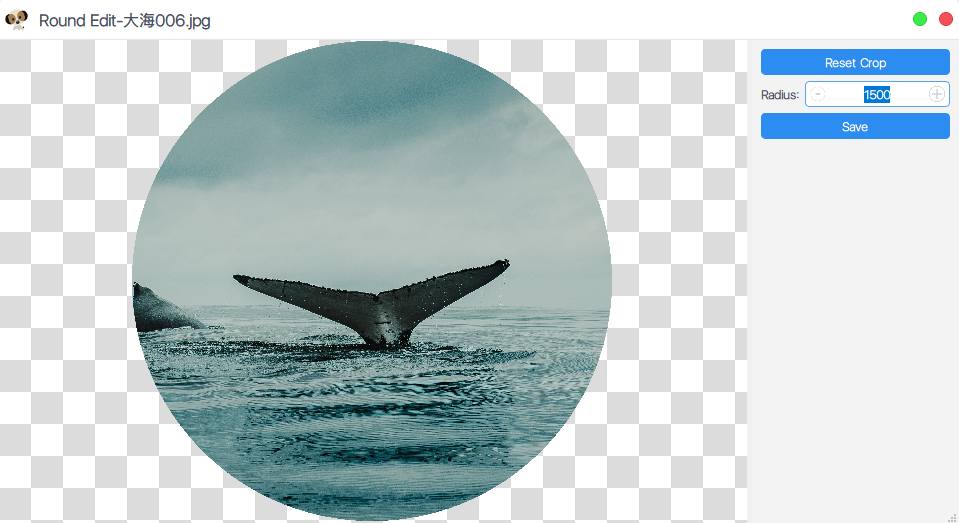
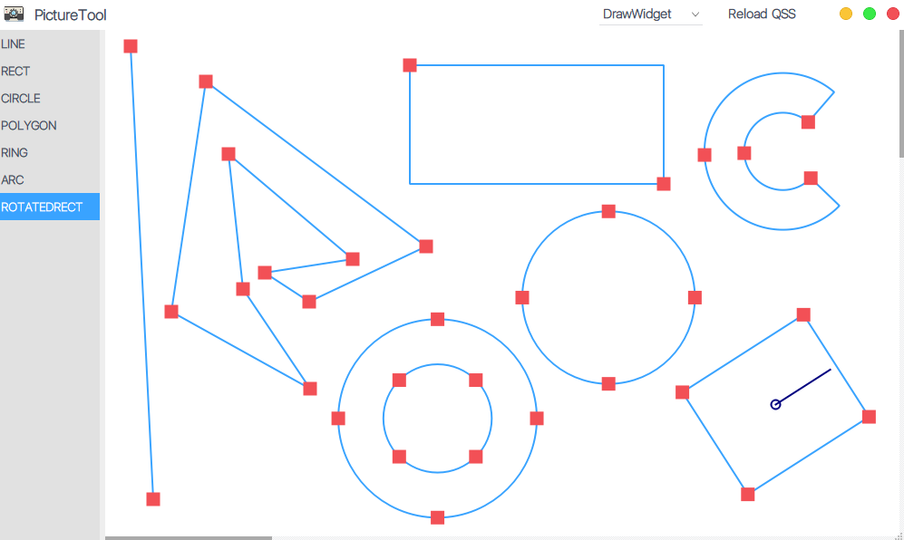
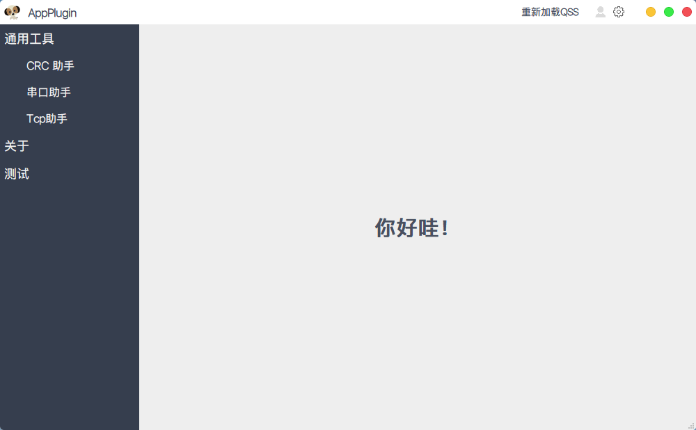
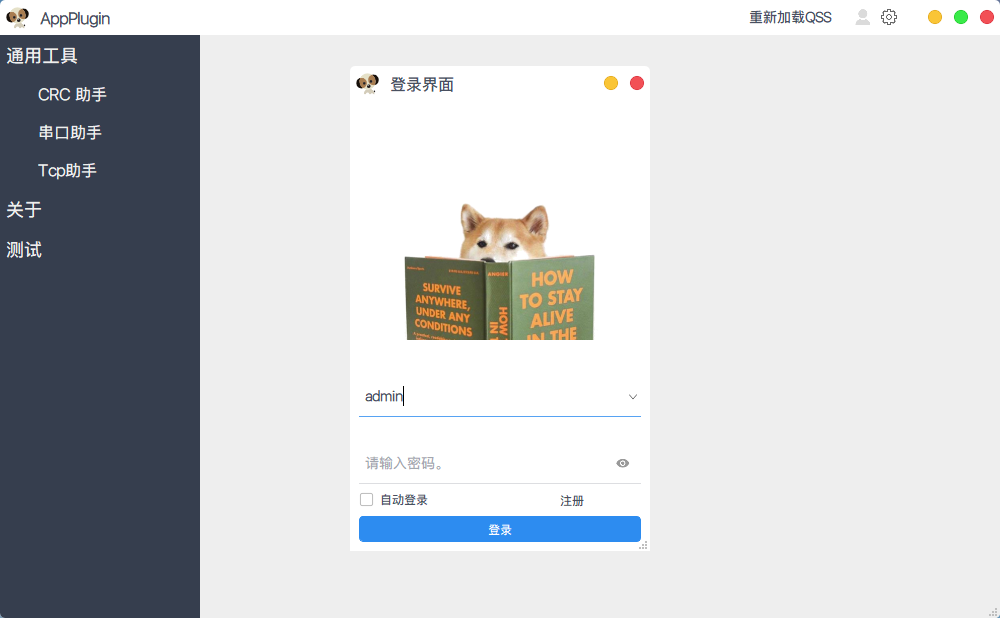
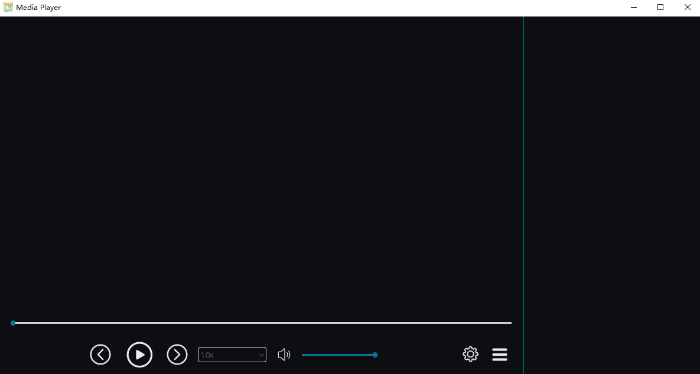
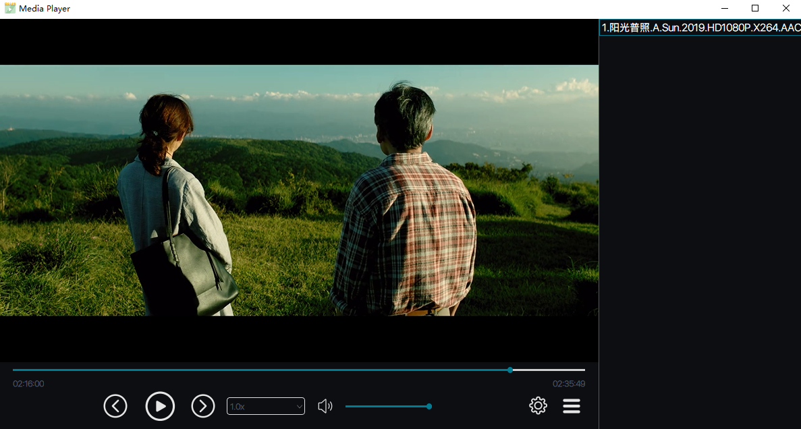

# AppTools  

## [中文说明](README.md)  

Picture resources and so on come from the Internet.  
This code repository is for learning only. If it is used by others for commercial purposes, it has nothing to do with me! Please observe the license!  

## The latest public library is in the app-subdir folder  

Surroundings: Qt 6.2.2	Visual Studio 2019  

UI Reference: [ Application template ](https://github.com/xtuer/template-app/tree/master/template-qt "xtuer/template-app")  

1. PictureTool:  A simple framework for viewing pictures and drawing simple graphics based on Qt Graphics View Framework;

2. Plugin-Template:  A template project written based on QtCreator's plug-in system has several small functions;

4. MediaPlayer: Super simple and simple multimedia player(Need to install LAVFilters so that more formats of audio and video can be decoded);  

   1. Another [Qt+Ffmpeg audio and video player](https://github.com/RealChuan/FfmpegPlayer), the interface is very rough (UI can refer to this program);  
   
   

### Instructions:  

1. Compile and build first;  

2. Copy the source code`resource`folder to the directory where the compiled executable file is located（`bin-32(64)/debug(release)/`）；  

4. Create a new `translations` folder under the executable program path (`bin-32(64)/debug(release)/`), and use the QtCreator tool-External-Qt Linguist to publish the translation to the `translations` folder; 

5. Starting program.  

   

### Interface display:  

1. #### PictureTool:  

   1. ##### Picture Interface:  
   	

  
   	
   2. ##### Mosaic Drawing Interface (Eraser effect):  
   

  
   
   3. ##### Round Corner Editing Window (Can also be edited as a round icon):  

       

  
   
       

  
   
       

  
   
   4. ##### Simple Graphical Drawing Interface:  
   
   

  
   
2. #### Plugin-Template
   
   

  
   
   

  
   
3. #### MediaPlayer  

   

  
   
   

  